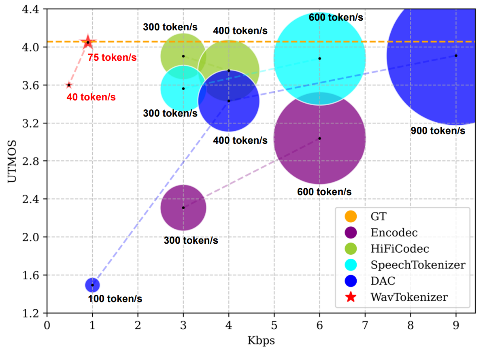

# WavTokenizer
SOTA Discrete Codec Models With Forty Tokens Per Second for Audio Language Modeling 


[](https://arxiv.org/abs/2408.16532)
[](https://wavtokenizer.github.io/)
[](https://huggingface.co/novateur/WavTokenizer)


### 🎉🎉 with WavTokenizer, you can represent speech, music, and audio with only 40 tokens per second!
### 🎉🎉 with WavTokenizer, You can get strong reconstruction results.
### 🎉🎉 WavTokenizer owns rich semantic information and is build for audio language models such as GPT-4o.

<!--
# Tips
We have noticed that several works (approximately exceed ten recent months) have incorrectly cited WavTokenizer. Below is the correct citation format. We sincerely appreciate the community's attention and interest.
```
@article{ji2024wavtokenizer,
  title={Wavtokenizer: an efficient acoustic discrete codec tokenizer for audio language modeling},
  author={Ji, Shengpeng and Jiang, Ziyue and Wang, Wen and Chen, Yifu and Fang, Minghui and Zuo, Jialong and Yang, Qian and Cheng, Xize and Wang, Zehan and Li, Ruiqi and others},
  journal={arXiv preprint arXiv:2408.16532},
  year={2024}
}
```
-->

# 🔥 News
- *2024.11.22*: We release WavChat (A survey of spoken dialogue models about 60 pages) on arxiv.
- *2024.10.22*: We update WavTokenizer on arxiv and release WavTokenizer-Large checkpoint.
- *2024.09.09*: We release WavTokenizer-medium checkpoint on [huggingface](https://huggingface.co/collections/novateur/wavtokenizer-medium-large-66de94b6fd7d68a2933e4fc0).
- *2024.08.31*: We release WavTokenizer on arxiv.




## Installation

To use WavTokenizer, install it using:

```bash
conda create -n wavtokenizer python=3.9
conda activate wavtokenizer
pip install -r requirements.txt
```

## Infer

### Part1: Reconstruct audio from raw wav

```python

from encoder.utils import convert_audio
import torchaudio
import torch
from decoder.pretrained import WavTokenizer


device=torch.device('cpu')

config_path = "./configs/xxx.yaml"
model_path = "./xxx.ckpt"
audio_outpath = "xxx"

wavtokenizer = WavTokenizer.from_pretrained0802(config_path, model_path)
wavtokenizer = wavtokenizer.to(device)


wav, sr = torchaudio.load(audio_path)
wav = convert_audio(wav, sr, 24000, 1) 
bandwidth_id = torch.tensor([0])
wav=wav.to(device)
features,discrete_code= wavtokenizer.encode_infer(wav, bandwidth_id=bandwidth_id)
audio_out = wavtokenizer.decode(features, bandwidth_id=bandwidth_id) 
torchaudio.save(audio_outpath, audio_out, sample_rate=24000, encoding='PCM_S', bits_per_sample=16)
```


### Part2: Generating discrete codecs
```python

from encoder.utils import convert_audio
import torchaudio
import torch
from decoder.pretrained import WavTokenizer

device=torch.device('cpu')

config_path = "./configs/xxx.yaml"
model_path = "./xxx.ckpt"

wavtokenizer = WavTokenizer.from_pretrained0802(config_path, model_path)
wavtokenizer = wavtokenizer.to(device)

wav, sr = torchaudio.load(audio_path)
wav = convert_audio(wav, sr, 24000, 1) 
bandwidth_id = torch.tensor([0])
wav=wav.to(device)
_,discrete_code= wavtokenizer.encode_infer(wav, bandwidth_id=bandwidth_id)
print(discrete_code)
```


### Part3: Audio reconstruction through codecs
```python
# audio_tokens [n_q,1,t]/[n_q,t]
features = wavtokenizer.codes_to_features(audio_tokens)
bandwidth_id = torch.tensor([0])  
audio_out = wavtokenizer.decode(features, bandwidth_id=bandwidth_id)
```

## 特徵提取

### 使用 extract_features.py 提取 encoder 特徵

可以使用以下命令從音頻文件中提取 WavTokenizer encoder 的特徵向量：

```bash
python extract_features.py --input "/path/to/audio/files" --output_dir "./results/features" --format "pt"
```

參數說明：
- `--input`: 輸入音頻文件或目錄路徑
- `--output_dir`: 特徵輸出目錄（可選，默認保存在音頻文件同目錄）
- `--format`: 輸出格式，可選 "pt" (PyTorch) 或 "npy" (NumPy)，默認為 "pt"
- `--config_path`: WavTokenizer 配置文件路徑（可選）
- `--model_path`: WavTokenizer 模型路徑（可選）
- `--device`: 使用的設備，"cuda" 或 "cpu"，默認為 "cuda"（若可用）

### 使用 tsne.py 中的提取模式

也可以使用 tsne.py 的 `--extract_only` 模式提取特徵：

```bash
python tsne.py --extract_only --input_dir "/path/to/audio/files" --save_dir "./results/features" --format "pt"
```

參數說明：
- `--extract_only`: 啟用僅提取特徵模式，不進行訓練
- `--input_dir`: 輸入音頻目錄
- `--save_dir`: 特徵保存目錄（可選）
- `--format`: 輸出格式，可選 "pt" 或 "npy"，默認為 "pt"

### 使用提取的特徵進行訓練或分析

提取的特徵可用於：
1. 幫助訓練 enhancement 層，作為參考答案
2. 分析特徵分佈差異
3. 比較 decoder 使用原始特徵與增強特徵的輸出差異

```python
# 載入保存的特徵
import torch
features = torch.load("box_boy1_001_encoder.pt")

# 用於訓練或分析
# ...
```

## Available models
🤗 links to the Huggingface model hub.

| Model name                                                          |                                                                                                            HuggingFace                                                                                                             |  Corpus  |  Token/s  | Domain | Open-Source |
|:--------------------------------------------------------------------|:------------------------------------------------------------------------------------------------------------------------------------------------------------------------------------------------------------------------------------:|:--------:|:---------:|:----------:|:------:|
| WavTokenizer-small-600-24k-4096             |             [🤗](https://huggingface.co/novateur/WavTokenizer/blob/main/WavTokenizer_small_600_24k_4096.ckpt)    | LibriTTS  | 40  |  Speech  | √ |
| WavTokenizer-small-320-24k-4096             |             [🤗](https://huggingface.co/novateur/WavTokenizer/blob/main/WavTokenizer_small_320_24k_4096.ckpt)     | LibriTTS  | 75 |  Speech  | √|
| WavTokenizer-medium-320-24k-4096                 |               [🤗](https://huggingface.co/collections/novateur/wavtokenizer-medium-large-66de94b6fd7d68a2933e4fc0)         | 10000 Hours | 75 |  Speech, Audio, Music  | √ |
| WavTokenizer-large-600-24k-4096 | [🤗](https://huggingface.co/novateur/WavTokenizer-large-unify-40token) | 80000 Hours | 40 |   Speech, Audio, Music   | √|
| WavTokenizer-large-320-24k-4096   | [🤗](https://huggingface.co/novateur/WavTokenizer-large-speech-75token) | 80000 Hours | 75 |   Speech, Audio, Music   | √ |

      

## Training

### Step1: Prepare train dataset
```python
# Process the data into a form similar to ./data/demo.txt
```

### Step2: Modifying configuration files
```python
# ./configs/xxx.yaml
# Modify the values of parameters such as batch_size, filelist_path, save_dir, device
```

### Step3: Start training process
Refer to [Pytorch Lightning documentation](https://lightning.ai/docs/pytorch/stable/) for details about customizing the
training pipeline.

```bash
cd ./WavTokenizer
python train.py fit --config ./configs/xxx.yaml
```


## Citation

If this code contributes to your research, please cite our work, Language-Codec and WavTokenizer:

```
@article{ji2024wavtokenizer,
  title={Wavtokenizer: an efficient acoustic discrete codec tokenizer for audio language modeling},
  author={Ji, Shengpeng and Jiang, Ziyue and Wang, Wen and Chen, Yifu and Fang, Minghui and Zuo, Jialong and Yang, Qian and Cheng, Xize and Wang, Zehan and Li, Ruiqi and others},
  journal={arXiv preprint arXiv:2408.16532},
  year={2024}
}

@article{ji2024language,
  title={Language-codec: Reducing the gaps between discrete codec representation and speech language models},
  author={Ji, Shengpeng and Fang, Minghui and Jiang, Ziyue and Huang, Rongjie and Zuo, Jialung and Wang, Shulei and Zhao, Zhou},
  journal={arXiv preprint arXiv:2402.12208},
  year={2024}
}
```

